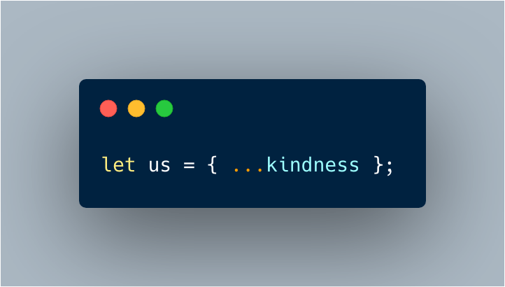

# What we covered

- Gatsby
- WordPress
- gatsby-source-wordpress
- gatsby-source-graphql
- WPGraphQL
- Gatsby Themes
- Gatsby WordPess Themes

---

# We are hiring! 🤗

## [rt.camp/join](https://rt.camp/join)

---

# Thank you! 😊

---

## This presentation was created with Gatsby + Markdown!

[gatsbyjs-montreal-meetup.muhammad.dev](https://gatsbyjs-montreal-meetup.muhammad.dev/)

[github.com/m-muhsin/gatsbyjs-montreal-meetup](https://github.com/m-muhsin/gatsbyjs-montreal-meetup)

---

# Resources

- [Gatsby and WordPress – best friends or foes?](https://muhammad.dev/blog/gatsby-and-wordpress-best-friends-or-foes)
- [Tutorial on creating a Gatsby Theme based on Twenty Nineteen WordPress Theme](https://javascriptforwp.com/porting-the-twenty-nineteen-wordpress-theme-to-gatsby/)
- [To create Presentations with Gatsby + Markdown](https://github.com/fabe/gatsby-starter-deck)

---

---

# Questions?